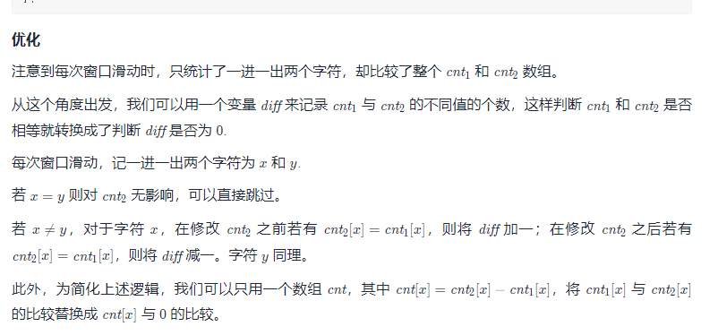

# Solution567

[题目描述](https://leetcode-cn.com/problems/permutation-in-string/)

给你两个字符串s1和s2 ，写一个函数来判断 s2 是否包含 s1的排列。如果是，返回 true ；否则，返回 false 。

换句话说，s1 的排列之一是 s2 的 子串 。

## 滑动窗口


```java
public static boolean checkInclusion(String s1, String s2) {
    int n = s1.length(), m = s2.length();
    if (n > m) {
        return false;
    }
    int[] cnt1 = new int[26];
    int[] cnt2 = new int[26];
    // 统计各个字母出现的次数
    for (int i = 0; i < n; ++i) {
        ++cnt1[s1.charAt(i) - 'a'];
        ++cnt2[s2.charAt(i) - 'a'];
    }
    // s2前面的n个字母与s1出现的字母都一样
    if (Arrays.equals(cnt1, cnt2)) {
        return true;
    }
    //窗口
    for (int i = n; i < m; ++i) {
        //向右滑动一位
        ++cnt2[s2.charAt(i) - 'a'];
        //剔除窗口最左一位
        --cnt2[s2.charAt(i - n) - 'a'];
        if (Arrays.equals(cnt1, cnt2)) {
            return true;
        }
    }
    return false;
}
```



```java
public boolean checkInclusion(String s1, String s2) {
    int n = s1.length(), m = s2.length();
    if (n > m) {
        return false;
    }
    int[] cnt = new int[26];
    for (int i = 0; i < n; ++i) {
        --cnt[s1.charAt(i) - 'a'];
        ++cnt[s2.charAt(i) - 'a'];
    }
    int diff = 0;
    for (int c : cnt) {
        if (c != 0) {
            ++diff;
        }
    }
    if (diff == 0) {
        return true;
    }
    for (int i = n; i < m; ++i) {
        int x = s2.charAt(i) - 'a', y = s2.charAt(i - n) - 'a';
        if (x == y) {
            continue;
        }
        if (cnt[x] == 0) {
            ++diff;
        }
        ++cnt[x];
        if (cnt[x] == 0) {
            --diff;
        }
        if (cnt[y] == 0) {
            ++diff;
        }
        --cnt[y];
        if (cnt[y] == 0) {
            --diff;
        }
        if (diff == 0) {
            return true;
        }
    }
    return false;
}
```

## 双指针


```java
public static boolean checkInclusion(String s1, String s2) {
    int n = s1.length(), m = s2.length();
    if (n > m) {
        return false;
    }
    int[] cnt = new int[26];
    for (int i = 0; i < n; ++i) {
        --cnt[s1.charAt(i) - 'a'];
    }
    int left = 0;
    for (int right = 0; right < m; ++right) {
        int x = s2.charAt(right) - 'a';
        ++cnt[x];
        while (cnt[x] > 0) {
            --cnt[s2.charAt(left) - 'a'];
            ++left;
        }
        if (right - left + 1 == n) {
            return true;
        }
    }
    return false;
}
```