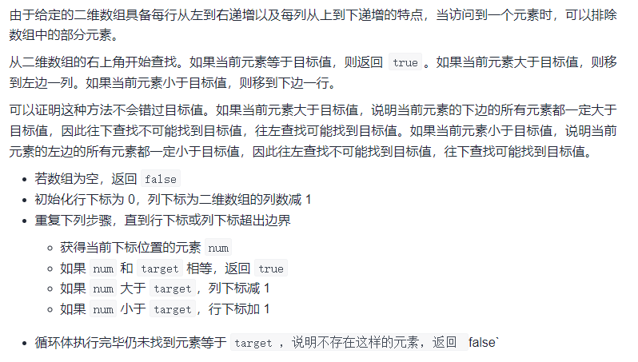
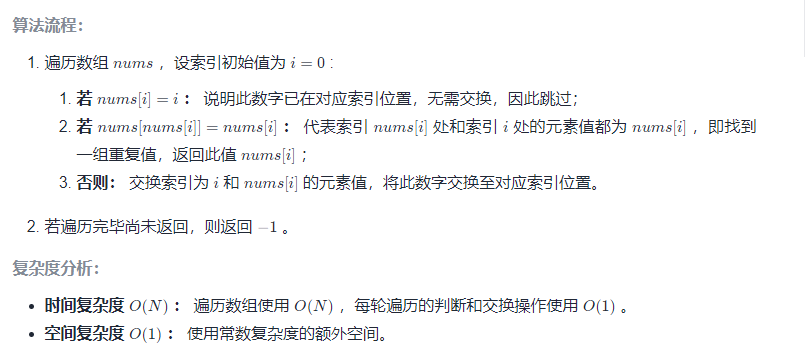
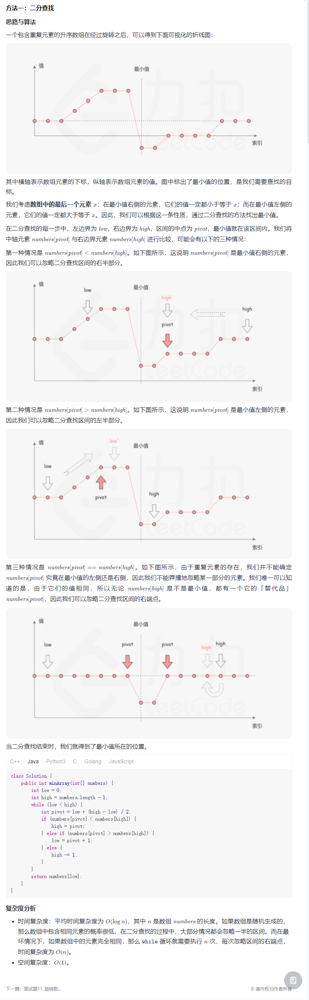

# 剑指Offer专题

## [用两个栈实现队列](https://leetcode-cn.com/problems/yong-liang-ge-zhan-shi-xian-dui-lie-lcof/)

**初始化**

- 初始化 `stack1` 和 `stack2` 为空

**插入元素**

- `stack1` 直接插入元素

**删除元素**

- 如果 `stack2` 为空，则将 `stack1` 里的所有元素弹出插入到 `stack2` 里

- 如果 `stack2` 仍为空，则返回 `-1`，否则从 `stack2` 弹出一个元素并返回

```java
class CQueue {

    Stack<Integer> stack1;
    Stack<Integer> stack2;

    public CQueue() {
        stack1 = new Stack<>();
        stack2 = new Stack<>();
    }

    public void appendTail(int value) {
        stack1.push(value);
    }

    public int deleteHead() {
        if (stack1.isEmpty() && stack2.isEmpty()) {
            return -1;
        }
        //出栈中的数据为空
        if (stack2.isEmpty()) {
            //将入栈中的数据全部压入
            while (!stack1.isEmpty()) {
                Integer pop = stack1.pop();
                stack2.push(pop);
            }
        }
        return stack2.pop();
    }
}
```

## [包含min函数的栈](https://leetcode-cn.com/problems/bao-han-minhan-shu-de-zhan-lcof/)

### 不使用辅助空间

要处理数据超出Integer范围

插入x时，插入原值与当前最小值的差

此时top>0，则说明原x比最小值大，出栈时，将x恢复，top = x - min ， x = min + top

top<0，则说明原x值，比最小值还小，最小值更新，top出栈时，要还原最小值 minOld = minNow + |x-minOld|

栈中存差值，具体见代码

/**
 * 不适用额外空间
 * 连续存最小值，存差值
 */
class MinStack {

    Stack<Long> stack1;
    Long minVal = Long.MIN_VALUE;

    /**
     * initialize your data structure here.
     */
    public MinStack() {
        stack1 = new Stack<>();
    }


```java
public void push(int x) {
        //栈 初始为空，压入0，最小值为 x
        if (stack1.isEmpty()) {
            stack1.push(0L);
            minVal = Long.valueOf(x);
        } else {
            // 栈不为空，压入 x-最小值
            stack1.push(x - minVal);
            //更新最小值
            minVal = Math.min(minVal, x);
        }
    }

    public void pop() {

        Long pop = stack1.pop();
        //栈顶元素小于0，说明x的原值小于之前的最小值，要恢复栈顶元素插入之前的最小值
        if (pop < 0) {
            // 存的是栈顶元素的差值与原最小值的差，恢复原最小值 = 现在的最小值 + 差值  （差值<0） 所以 min = min - pop
            minVal = minVal - pop;
        }
    }

    public int top() {
        //return self.minv + top if top >= 0 else self.minv
        Long peek = stack1.peek();
        //如果peek>0  说明 x比minVal大，栈内存的 peek = x-minVal 恢复原来的 x = minVal + peek
        if (peek > 0) {
            return (int) (peek + minVal);
        } else {
            // 否则  说明x的值比当时的最小值小，peek即最小值
            return min();
        }
    }

    //最小值
    public int min() {
        return minVal.intValue();
    }
}
```
### 辅助栈

```java
/**
 * 辅助栈中保证有序，降低辅助栈中元素个数
 */
class MinStack2 {

    Stack<Integer> stack1;
    Stack<Integer> stack2;

    /**
     * initialize your data structure here.
     */
    public MinStack2() {
        stack1 = new Stack<>();
        stack2 = new Stack<>();
    }

    // 保证栈2中元素降序
    public void push(int x) {
        stack1.push(x);
        if (stack2.isEmpty() || x <= stack2.peek()) {
            stack2.push(x);
        }
    }

    public void pop() {
        Integer pop = stack1.pop();
        if (pop.equals(stack2.peek())) {
            stack2.pop();
        }
    }

    public int top() {
        return stack1.peek();
    }

    public int min() {
        return stack2.peek();
    }
}

/**
 * 借助两个栈实现,每次添加或者删除元素时同时维护当前的最小值
 */
class MinStack1 {

    Stack<Integer> stack1;
    Stack<Integer> stack2;
    Integer minVal;

    /**
     * initialize your data structure here.
     */
    public MinStack1() {
        stack1 = new Stack<>();
        stack2 = new Stack<>();
    }

    public void push(int x) {
        if (stack1.isEmpty()) {
            minVal = x;
        } else {
            minVal = Math.min(minVal, x);
        }
        stack1.push(x);
        stack2.push(minVal);
    }

    public void pop() {
        stack1.pop();
        stack2.pop();
        if (!stack2.isEmpty()) {
            minVal = stack2.peek();
        }
    }

    public int top() {
        if (stack1.isEmpty()) {
            return -1;
        }
        return stack1.peek();
    }

    public int min() {
        if (stack2.isEmpty()) {
            return -1;
        }
        return stack2.peek();
    }
}
```

## [二维数组中的查找](https://leetcode-cn.com/problems/er-wei-shu-zu-zhong-de-cha-zhao-lcof/)

在一个 n * m 的二维数组中，每一行都按照从左到右递增的顺序排序，每一列都按照从上到下递增的顺序排序。请完成一个高效的函数，输入这样的一个二维数组和一个整数，判断数组中是否含有该整数。

### 逐行二分

```java
/**
 * 确定区间后 逐行二分
 *
 * @param matrix
 * @param target
 * @return
 */
public static boolean findNumberIn2DArray1(int[][] matrix, int target) {
    int n = matrix.length;
    if (n == 0) {
        return false;
    }
    if (n == 1) {
        return search(matrix[0], target);
    }
    int m = matrix[0].length;
    for (int i = 0; i < n; i++) {
        if (matrix[i][0] <= target && matrix[i][m - 1] >= target) {
            boolean search = search(matrix[i], target);
            if (search) {
                return true;
            }
        }
    }
    return false;
}

public static boolean search(int[] a, int target) {
    int low = 0;
    int high = a.length - 1;
    while (low <= high) {
        int middle = low + (high - low) / 2;
        if (a[middle] > target) {
            high = middle - 1;
        } else if (a[middle] < target) {
            low = middle + 1;
        } else {
            return true;
        }
    }
    return false;
}
```

### 线性查找



```java
public static boolean findNumberIn2DArray(int[][] matrix, int target) {
    int n = matrix.length;
    if (n == 0) {
        return false;
    }
    int m = matrix[0].length;
    int row = 0, column = m - 1;
    while (row < n && column >= 0) {
        if (matrix[row][column] == target) {
            return true;
        } else if (matrix[row][column] > target) {
            //如果目标值比当前位置小，说明在左侧列
            column--;
        } else if (matrix[row][column] < target) {
            //如果目标值比当前位置大，说明在下面行
            row++;
        }
    }
    return false;
}
```

## [数组中重复的数字](https://leetcode-cn.com/problems/shu-zu-zhong-zhong-fu-de-shu-zi-lcof/)

在一个长度为 n 的数组 nums 里的所有数字都在 0～n-1 的范围内。数组中某些数字是重复的，但不知道有几个数字重复了，也不知道每个数字重复了几次。请找出数组中任意一个重复的数字。

### HashSet

```java
public static int findRepeatNumber(int[] nums) {
    Set<Integer> dic = new HashSet<>();
    for (int num : nums) {
        if (dic.contains(num)) {
            return num;
        }
        dic.add(num);
    }
    return -1;
}
```

### 辅助数组

nums 里的所有数字都在 0～n-1 的范围内，使用另一个数组存储每个数出现的次数，记录当前的最大次数，直到有出现次数更多的数。

```java
public static int findRepeatNumber(int[] nums) {
    int[] sum = new int[nums.length];
    int max = -1;
    int maxVal = -1;
    for (int num : nums) {
        sum[num]++;
        if (sum[num] > max) {
            max = sum[num];
            maxVal = num;
        }
    }
    return maxVal;
}
```

### 原地交换

[原地交换](https://leetcode-cn.com/problems/shu-zu-zhong-zhong-fu-de-shu-zi-lcof/solution/mian-shi-ti-03-shu-zu-zhong-zhong-fu-de-shu-zi-yua/)



```java
public static int findRepeatNumber(int[] nums) {
    int i = 0, n = nums.length;
    while (i < n) {
        //索引nums[i]位置已经换过，
        if (nums[i] == i) {
            i++;
            continue;
        }
        if (nums[nums[i]] == nums[i]) {
            return nums[i];
        }
        swap(nums, i, nums[i]);
    }
    return -1;
}

public static void swap(int[] nums, int i, int j) {
    int temp = nums[i];
    nums[i] = nums[j];
    nums[j] = temp;
}
```

## [旋转数组的最小数字](https://leetcode-cn.com/problems/xuan-zhuan-shu-zu-de-zui-xiao-shu-zi-lcof/)

把一个数组最开始的若干个元素搬到数组的末尾，我们称之为数组的旋转。

给你一个可能存在 重复 元素值的数组 numbers ，它原来是一个升序排列的数组，并按上述情形进行了一次旋转。请返回旋转数组的最小元素。例如，数组 [3,4,5,1,2] 为 [1,2,3,4,5] 的一次旋转，该数组的最小值为1。  



```java
public static int minArray(int[] numbers) {
    int low = 0;
    int high = numbers.length - 1;
    while (low < high) {
        int mid = low + (high - low) / 2;
        // 如果 num[mid] > num[high] 说明最小值在mid右边
        if (numbers[high] < numbers[mid]) {
            low = mid + 1;
        } else if (numbers[high] > numbers[mid]) {
            high = mid;
        } else {
            high--;
        }
    }
    return numbers[low];
}
```